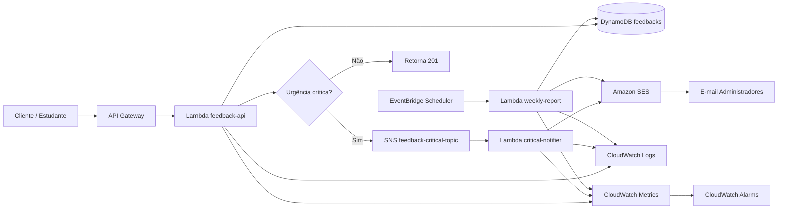
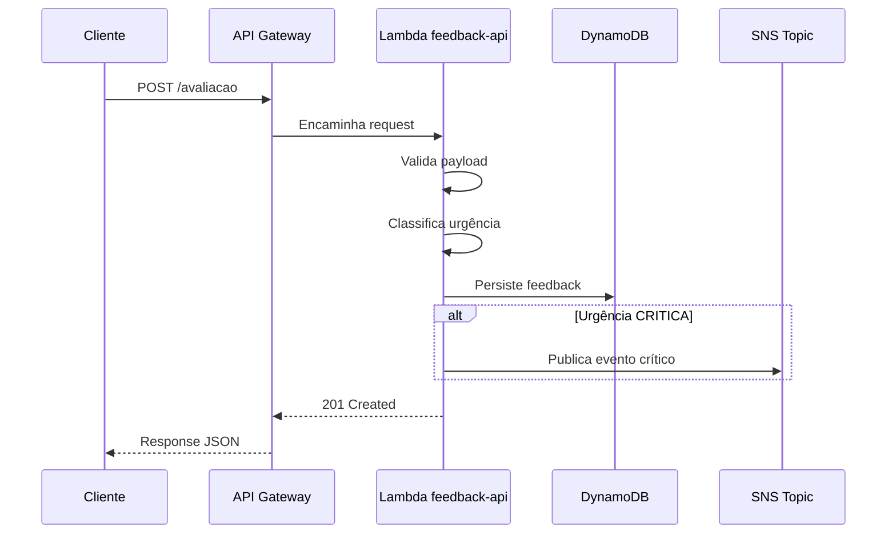
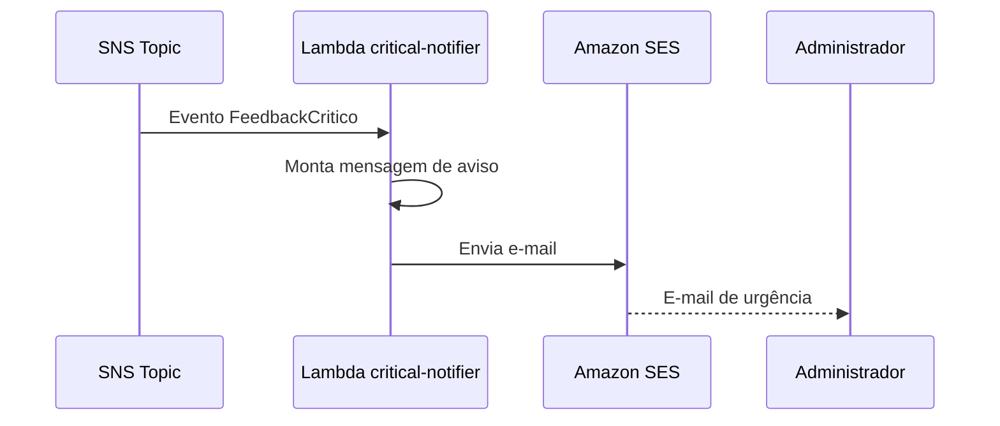
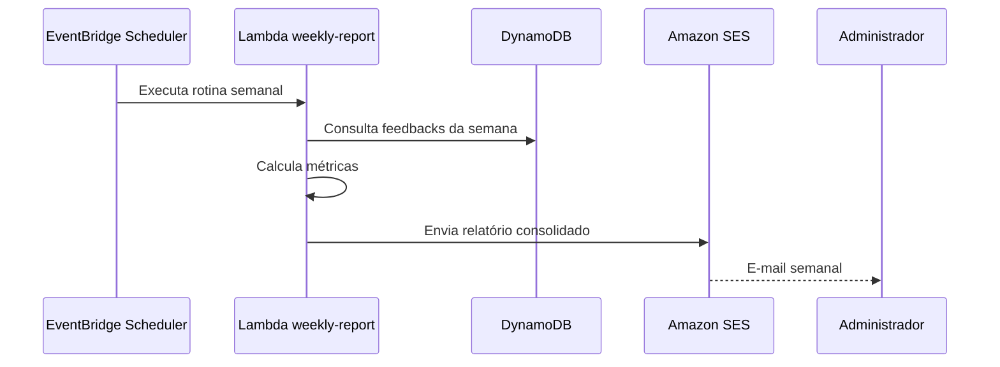
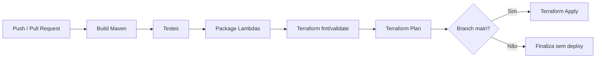

# Especificação Técnica – Plataforma de Feedback Educacional

## 1. Visão Geral

Plataforma cloud-native e serverless para coleta, classificação, notificação e consolidação de feedbacks de estudantes.

Esta especificação serve como guia interno de desenvolvimento do grupo, descrevendo arquitetura, responsabilidades, regras de negócio, contratos de API, observabilidade e instruções de execução local/deploy.

## 2. Stack Técnica

- Java 21 LTS
- Quarkus
- AWS Lambda
- Amazon API Gateway
- Amazon DynamoDB
- Amazon SNS
- Amazon SES
- Amazon EventBridge Scheduler
- Amazon CloudWatch
- Terraform
- GitHub Actions
- fakecloud
- Testcontainers
- JUnit 5
- Mockito
- RestAssured

---

## 3. Objetivos do Projeto

- Receber feedbacks de estudantes via API REST.
- Validar os dados enviados.
- Classificar automaticamente a urgência do feedback.
- Persistir feedbacks no DynamoDB.
- Notificar administradores quando houver feedback crítico.
- Gerar relatório semanal com consolidação dos feedbacks.
- Manter logs, métricas e alarmes para acompanhamento operacional.
- Automatizar build, testes e deploy.

Nota de aderência ao enunciado: o PDF usa `POST /avaliação` como referência do endpoint de entrada. Esta especificação adota `POST /avaliacao`, sem acento, para evitar problemas de encoding em URLs, clientes HTTP, API Gateway e ferramentas de teste.

---

## 4. Arquitetura AWS Detalhada

### 4.1 Visão Geral dos Componentes

| Componente | Responsabilidade |
|---|---|
| API Gateway | Expor o endpoint REST público da aplicação. |
| Lambda `feedback-api` | Receber, validar, classificar e persistir avaliações. |
| DynamoDB `feedbacks` | Armazenar os feedbacks recebidos. |
| SNS Topic `feedback-critical-topic` | Publicar eventos de feedback crítico. |
| Lambda `critical-notifier` | Consumir evento crítico e enviar e-mail administrativo. |
| SES | Enviar e-mails de notificação e relatório. |
| EventBridge Scheduler | Executar a geração do relatório semanal. |
| Lambda `weekly-report` | Consolidar avaliações e enviar relatório semanal. |
| CloudWatch Logs | Armazenar logs das funções. |
| CloudWatch Metrics | Coletar métricas operacionais. |
| CloudWatch Alarms | Alertar falhas, erros e timeouts. |
| IAM | Controlar permissões por responsabilidade. |

### 4.2 Diagrama Arquitetural



### 4.3 Fluxo de Registro de Feedback



### 4.4 Fluxo de Notificação Crítica



### 4.5 Fluxo de Relatório Semanal



### 4.6 Responsabilidades das Lambdas

#### Lambda `feedback-api`

Trigger: API Gateway.

Responsabilidades:

- Receber `POST /avaliacao`.
- Validar payload.
- Classificar urgência.
- Gerar `id` e `dataEnvio`.
- Persistir feedback no DynamoDB.
- Publicar evento no SNS quando a urgência for `CRITICA`.
- Retornar resposta HTTP adequada.

Não deve:

- Enviar e-mail diretamente.
- Gerar relatório.
- Concentrar regras de infraestrutura fora dos adapters.

#### Lambda `critical-notifier`

Trigger: SNS.

Responsabilidades:

- Consumir evento de feedback crítico.
- Montar e-mail de aviso de urgência.
- Enviar e-mail via SES.
- Registrar logs de sucesso/falha.

Dados mínimos do e-mail:

- Descrição.
- Urgência.
- Data de envio.

#### Lambda `weekly-report`

Trigger: EventBridge Scheduler.

Responsabilidades:

- Buscar feedbacks da semana.
- Calcular média das avaliações.
- Calcular quantidade de avaliações por dia.
- Calcular quantidade de avaliações por urgência.
- Enviar relatório semanal por e-mail.

Dados mínimos do relatório:

- Média geral das avaliações.
- Quantidade de avaliações por dia.
- Quantidade de avaliações por urgência.
- Lista resumida dos feedbacks da semana contendo descrição, urgência e data de envio.
- Destaque separado para feedbacks críticos, quando existirem.

---

## 5. Modelo de Dados

### 5.1 Tabela DynamoDB `feedbacks`

| Campo | Tipo | Obrigatório | Descrição |
|---|---|---|---|
| `id` | String UUID | Sim | Identificador único do feedback. |
| `descricao` | String | Sim | Texto enviado pelo estudante. |
| `nota` | Number | Sim | Nota de 0 a 10. |
| `urgencia` | String | Sim | `CRITICA`, `MEDIA` ou `BAIXA`. |
| `dataEnvio` | String ISO-8601 | Sim | Data/hora de recebimento. |
| `correlationId` | String | Sim | ID de rastreamento da requisição. |
| `periodo` | String | Sim | Período de referência no formato AAAA-Www (ano e semana ISO-8601), ex: 2026-W22. Gerado automaticamente pelo backend a partir de dataEnvio, usado como Partition Key da GSI dataEnvio-index para consultas do relatório semanal. |

### 5.2 Chaves e Índices

Configuração mínima:

- Partition Key: `id`.

Índice recomendado para relatório semanal:

- GSI: `dataEnvio-index`.
- Partition Key: `periodo`, por exemplo `2026-W22`.
- Sort Key: `dataEnvio`.

Caso o grupo opte por manter a tabela mais simples, o relatório pode realizar scan filtrando por `dataEnvio`, mas essa abordagem deve ser usada apenas para baixo volume acadêmico.

### 5.3 Exemplo de Item

```json
{
  "id": "018f7e7a-5c45-7a24-8de1-f8ff2b7d4f91",
  "descricao": "A aula estava confusa e não consegui acompanhar o conteúdo.",
  "nota": 2,
  "urgencia": "CRITICA",
  "dataEnvio": "2026-05-31T13:00:00Z",
  "periodo": "2026-W22",
  "correlationId": "58d4d37b-5072-40b3-8a33-3f5e89c1cd4d"
}
```

---

## 6. Regras de Negócio

### RN001 — Descrição obrigatória

O campo `descricao` deve ser informado.

### RN002 — Tamanho da descrição

A descrição deve conter:

- mínimo de 10 caracteres;
- máximo de 1000 caracteres.

### RN003 — Nota obrigatória

O campo `nota` deve ser informado.

### RN004 — Nota válida

A nota deve ser um número inteiro entre 0 e 10.

Valores inválidos:

- menor que 0;
- maior que 10;
- decimal;
- texto;
- nulo.

### RN005 — Classificação de urgência

A urgência é calculada automaticamente a partir da nota.

| Faixa da nota | Urgência | Descrição |
|---:|---|---|
| 0 a 3 | `CRITICA` | Feedback indica problema grave ou insatisfação alta. |
| 4 a 6 | `MEDIA` | Feedback indica pontos de atenção. |
| 7 a 10 | `BAIXA` | Feedback indica satisfação aceitável ou positiva. |

### RN006 — Casos de borda da classificação

| Nota | Urgência esperada |
|---:|---|
| 0 | `CRITICA` |
| 3 | `CRITICA` |
| 4 | `MEDIA` |
| 6 | `MEDIA` |
| 7 | `BAIXA` |
| 10 | `BAIXA` |

### RN007 — Notificação de urgência crítica

Todo feedback classificado como `CRITICA` deve gerar evento no SNS para notificação administrativa.

A Lambda de recebimento não deve enviar o e-mail diretamente. O envio deve ser realizado pela Lambda `critical-notifier`.

### RN008 — Relatório semanal

O relatório semanal deve ser gerado automaticamente pelo EventBridge Scheduler.

Execução sugerida:

- domingo às 23h59;
- timezone: `America/Sao_Paulo`, se configurado no EventBridge Scheduler;
- caso o timezone não seja usado, configurar em UTC considerando o horário equivalente.

Conteúdo mínimo:

- média das avaliações da semana;
- quantidade de avaliações por dia;
- quantidade de avaliações por urgência;
- lista resumida dos feedbacks da semana contendo descrição, urgência e data de envio;
- destaque separado para feedbacks críticos da semana.

### RN009 — Data de envio

A `dataEnvio` deve ser gerada pelo backend no momento do recebimento do feedback.

O cliente não deve enviar nem sobrescrever esse campo.

### RN010 — Identificador do feedback

O `id` deve ser gerado pelo backend em formato UUID.

---

## 7. Política de Erros da API

### 7.1 Padrão de Erro

Todos os erros devem seguir o mesmo formato:

```json
{
  "code": "VALIDATION_ERROR",
  "message": "Campo nota é obrigatório.",
  "correlationId": "58d4d37b-5072-40b3-8a33-3f5e89c1cd4d",
  "details": [
    {
      "field": "nota",
      "message": "não deve ser nulo"
    }
  ]
}
```

### 7.2 Códigos HTTP

| Código | Situação | Exemplo |
|---:|---|---|
| 201 | Recurso criado | Feedback registrado com sucesso. |
| 400 | Payload malformado ou campo ausente | JSON inválido, `descricao` ausente. |
| 422 | Regra de negócio violada | `nota` fora do intervalo permitido. |
| 429 | Limite de requisições excedido | Throttling no API Gateway. |
| 500 | Erro interno | Falha inesperada ao processar. |

### 7.3 Códigos internos de erro

| Código interno | Uso |
|---|---|
| `VALIDATION_ERROR` | Falha de validação de campos obrigatórios ou formato. |
| `MALFORMED_JSON` | Corpo da requisição não é um JSON válido. |
| `BUSINESS_RULE_ERROR` | Violação de regra de negócio. |
| `PERSISTENCE_ERROR` | Falha ao gravar no DynamoDB. |
| `NOTIFICATION_ERROR` | Falha ao publicar/enviar notificação. |
| `INTERNAL_ERROR` | Falha inesperada. |
| `TOO_MANY_REQUESTS` | Requisição bloqueada por limite de tráfego. |

---

## 8. Contrato da API

A especificação OpenAPI completa:

```text
/docs/openapi-feedback-api.yaml
```

Endpoint principal:

```http
POST /avaliacao
Content-Type: application/json
X-Correlation-Id: opcional
```

Request:

```json
{
  "descricao": "A aula estava confusa e não consegui acompanhar o conteúdo.",
  "nota": 2
}
```

Response `201`:

```json
{
  "id": "018f7e7a-5c45-7a24-8de1-f8ff2b7d4f91",
  "status": "CREATED",
  "urgencia": "CRITICA",
  "dataEnvio": "2026-05-31T13:00:00Z"
}
```

---

## 9. Logging e Observabilidade

### 9.1 Princípios

- Todos os logs devem ser estruturados em JSON.
- Toda requisição deve possuir `correlationId`.
- O `correlationId` deve ser propagado entre API Gateway, Lambda, SNS e logs.
- Logs não devem expor dados sensíveis.
- Erros devem conter contexto suficiente para investigação.

### 9.2 Geração do Correlation ID

Regra:

1. Se o header `X-Correlation-Id` for enviado, reutilizar o valor.
2. Caso contrário, gerar um UUID.
3. Retornar o correlation ID no header da resposta.
4. Persistir o correlation ID junto do feedback.

### 9.3 Formato de Log

Exemplo:

```json
{
  "timestamp": "2026-05-31T13:00:00Z",
  "level": "INFO",
  "service": "feedback-api",
  "operation": "createFeedback",
  "correlationId": "58d4d37b-5072-40b3-8a33-3f5e89c1cd4d",
  "feedbackId": "018f7e7a-5c45-7a24-8de1-f8ff2b7d4f91",
  "message": "Feedback persisted successfully"
}
```

### 9.4 Eventos de Log por Lambda

#### `feedback-api`

| Evento | Nível |
|---|---|
| Requisição recebida | INFO |
| Payload inválido | WARN |
| Feedback persistido | INFO |
| Evento crítico publicado | INFO |
| Falha DynamoDB | ERROR |
| Falha SNS | ERROR |

#### `critical-notifier`

| Evento | Nível |
|---|---|
| Evento SNS recebido | INFO |
| E-mail enviado | INFO |
| Falha SES | ERROR |

#### `weekly-report`

| Evento | Nível |
|---|---|
| Job iniciado | INFO |
| Quantidade de registros processados | INFO |
| Relatório enviado | INFO |
| Nenhum feedback encontrado na semana | INFO |
| Falha ao consultar DynamoDB | ERROR |
| Falha SES | ERROR |

### 9.5 Métricas CloudWatch

Métricas recomendadas:

| Métrica | Origem | Objetivo |
|---|---|---|
| `FeedbackReceivedCount` | `feedback-api` | Quantidade de feedbacks recebidos. |
| `CriticalFeedbackCount` | `feedback-api` | Quantidade de feedbacks críticos. |
| `ValidationErrorCount` | `feedback-api` | Quantidade de erros de validação. |
| `NotificationSentCount` | `critical-notifier` | Quantidade de e-mails críticos enviados. |
| `NotificationFailureCount` | `critical-notifier` | Falhas no envio de notificação. |
| `WeeklyReportSentCount` | `weekly-report` | Relatórios enviados. |
| `WeeklyReportFailureCount` | `weekly-report` | Falhas na geração ou envio. |

### 9.6 Alarmes CloudWatch

| Alarme | Condição sugerida |
|---|---|
| Erros Lambda | `Errors > 0` em 5 minutos. |
| Timeout Lambda | `Duration` próximo ao timeout configurado. |
| Falha de notificação | `NotificationFailureCount > 0`. |
| Falha de relatório | `WeeklyReportFailureCount > 0`. |
| Throttling | `Throttles > 0`. |

### 9.7 Dashboard CloudWatch

Dashboard mínimo:

- total de feedbacks recebidos;
- feedbacks críticos;
- erros por Lambda;
- duração média das Lambdas;
- invocações por Lambda;
- falhas de e-mail;
- última execução do relatório semanal.

---

## 10. Arquitetura Limpa no Código

Estrutura sugerida:

```text
src/main/java/br/com/fiap/{app}/
 ├── core/
 │  ├── domain/
 │  ├── dto/
 │  ├── exception/
 │  ├── gateway/
 │  └── usecase/
 ├── infra/
 │  ├── config/
 │  ├── gateway/
 │  │   ├── db/
 │  │   │ ├── entity/
 │  │   │ ├── mapper/
 │  │   │ └── repository/
 │  │   ├── sns/
 └──└── └── ses/
```

Regras:

- Domínio não depende de AWS SDK.
- Casos de uso dependem de interfaces/ports.
- Adapters implementam integrações com DynamoDB, SNS e SES.
- DTOs da API não devem ser usados como entidades de domínio.

---

## 11. Estrutura do Repositório

```text
feedback-platform/
 ├── apps/
 │   ├── feedback-api/
 │   ├── critical-notifier/
 │   └── weekly-report/
 ├── libs/
 │   └── shared-kernel/
 ├── infra/
 │   ├── modules/
 │   │   ├── api-gateway/
 │   │   ├── lambda/
 │   │   ├── dynamodb/
 │   │   ├── sns/
 │   │   ├── ses/
 │   │   ├── eventbridge/
 │   │   └── cloudwatch/
 │   └── environments/
 │       ├── dev/
 │       └── prod/
 ├── docs/
 │   ├── Especificacao_Tecnica_Plataforma_Feedback.md
 │   └── openapi-feedback-api.yaml
 ├── docker-compose.yml
 ├── pom.xml
 └── .github/
     └── workflows/
         └── ci-cd.yml
```

---

## 12. Variáveis de Ambiente

### 12.1 `feedback-api`

| Variável | Exemplo | Descrição |
|---|---|---|
| `FEEDBACK_TABLE_NAME` | `feedbacks-dev` | Nome da tabela DynamoDB. |
| `CRITICAL_TOPIC_ARN` | `arn:aws:sns:...` | ARN do tópico SNS para feedbacks críticos. |
| `AWS_REGION` | `us-east-1` | Região AWS. |
| `LOG_LEVEL` | `INFO` | Nível de log. |

### 12.2 `critical-notifier`

| Variável | Exemplo | Descrição |
|---|---|---|
| `ADMIN_EMAIL_TO` | `admin@example.com` | Destinatário da notificação. |
| `EMAIL_FROM` | `no-reply@example.com` | Remetente validado no SES. |
| `AWS_REGION` | `us-east-1` | Região AWS. |
| `LOG_LEVEL` | `INFO` | Nível de log. |
| `PROCESSING_CONTROL_TABLE_NAME` | `feedback-processing-control-dev` | Tabela DynamoDB auxiliar para idempotência por período. |

### 12.3 `weekly-report`

| Variável | Exemplo | Descrição |
|---|---|---|
| `FEEDBACK_TABLE_NAME` | `feedbacks-dev` | Nome da tabela DynamoDB. |
| `ADMIN_EMAIL_TO` | `admin@example.com` | Destinatário do relatório. |
| `EMAIL_FROM` | `no-reply@example.com` | Remetente validado no SES. |
| `AWS_REGION` | `us-east-1` | Região AWS. |
| `LOG_LEVEL` | `INFO` | Nível de log. |

---

## 13. Execução Local

Nota: os comandos Maven desta seção passam a ser executáveis após a criação do `pom.xml` raiz e dos módulos `apps/feedback-api`, `apps/critical-notifier`, `apps/weekly-report` e `libs/shared-kernel`.

### 13.1 Pré-requisitos

- Java 21 LTS.
- Maven 3.9+.
- Docker.
- Docker Compose.
- AWS CLI.
- Terraform 1.6+.

### 13.2 Subir dependências locais

O ambiente AWS local será executado via **fakecloud**.

Arquivo `docker-compose.yml` sugerido:

```yaml
services:
  fakecloud:
    image: ghcr.io/faiscadev/fakecloud:latest
    container_name: aws-fakecloud
    ports:
      - "4566:4566"
    environment:
      - SERVICES=dynamodb,sns,ses,events,lambda,logs,cloudwatch,iam,apigateway
      - AWS_DEFAULT_REGION=us-east-1
      - DEBUG=1
    volumes:
      - "./.fakecloud:/var/lib/fakecloud"
      - "/var/run/docker.sock:/var/run/docker.sock"
```

Comando:

```bash
docker compose up -d
```

### 13.3 Configurar credenciais locais

```bash
export AWS_ACCESS_KEY_ID=test
export AWS_SECRET_ACCESS_KEY=test
export AWS_REGION=us-east-1
export AWS_ENDPOINT_URL=http://localhost:4566
```

### 13.4 Criar recursos locais no fakecloud

Tabela DynamoDB:

```bash
aws --endpoint-url=http://localhost:4566 dynamodb create-table \
  --table-name feedbacks-local \
  --attribute-definitions \
    AttributeName=id,AttributeType=S \
    AttributeName=periodo,AttributeType=S \
    AttributeName=dataEnvio,AttributeType=S \
  --key-schema AttributeName=id,KeyType=HASH \
  --global-secondary-indexes '[
    {
      "IndexName": "dataEnvio-index",
      "KeySchema": [
        {"AttributeName": "periodo", "KeyType": "HASH"},
        {"AttributeName": "dataEnvio", "KeyType": "RANGE"}
      ],
      "Projection": {"ProjectionType": "ALL"}
    }
  ]' \
  --billing-mode PAY_PER_REQUEST
```

Tabela de controle de processamento semanal:

```bash
aws --endpoint-url=http://localhost:4566 dynamodb create-table \
  --table-name feedback-processing-control-local \
  --attribute-definitions AttributeName=periodo,AttributeType=S \
  --key-schema AttributeName=periodo,KeyType=HASH \
  --billing-mode PAY_PER_REQUEST
```

SNS Topic:

```bash
aws --endpoint-url=http://localhost:4566 sns create-topic \
  --name feedback-critical-topic-local
```

Verificar e-mail no SES local:

```bash
aws --endpoint-url=http://localhost:4566 ses verify-email-identity \
  --email-address admin@example.com
```

### 13.5 Executar aplicação Quarkus local

```bash
./mvnw clean quarkus:dev \
  -Dquarkus.profile=local
```

Variáveis esperadas:

```bash
export FEEDBACK_TABLE_NAME=feedbacks-local
export PROCESSING_CONTROL_TABLE_NAME=feedback-processing-control-local
export CRITICAL_TOPIC_ARN=arn:aws:sns:us-east-1:000000000000:feedback-critical-topic-local
export ADMIN_EMAIL_TO=admin@example.com
export EMAIL_FROM=no-reply@example.com
```

### 13.6 Testar API local

```bash
curl -i -X POST http://localhost:8080/avaliacao \
  -H 'Content-Type: application/json' \
  -H 'X-Correlation-Id: teste-local-001' \
  -d '{
    "descricao": "A aula estava confusa e não consegui acompanhar o conteúdo.",
    "nota": 2
  }'
```

Resposta esperada:

```json
{
  "id": "uuid",
  "status": "CREATED",
  "urgencia": "CRITICA",
  "dataEnvio": "2026-05-31T13:00:00Z"
}
```

### 13.7 Rodar testes

```bash
./mvnw test
```

Com testes de integração:

```bash
./mvnw verify -Pintegration-test
```

---

## 14. Deploy em AWS

### 14.1 Pré-requisitos

- Conta AWS configurada.
- AWS CLI autenticado.
- Terraform instalado.
- E-mail remetente validado no SES.
- Permissões para criar recursos: Lambda, API Gateway, DynamoDB, SNS, SES, EventBridge, CloudWatch e IAM.

### 14.2 Build das Lambdas

```bash
./mvnw clean package -DskipTests=false
```

Para build otimizado para Lambda, usar o profile definido no projeto:

```bash
./mvnw clean package -Paws-lambda
```

Artefatos esperados:

```text
apps/feedback-api/target/function.zip
apps/critical-notifier/target/function.zip
apps/weekly-report/target/function.zip
```

### 14.3 Deploy com Terraform

Acessar o ambiente desejado:

```bash
cd infra/environments/dev
```

Inicializar:

```bash
terraform init
```

Validar:

```bash
terraform validate
```

Planejar:

```bash
terraform plan \
  -var="aws_region=us-east-1" \
  -var="environment=dev" \
  -var="admin_email_to=admin@example.com" \
  -var="email_from=no-reply@example.com"
```

Aplicar:

```bash
terraform apply \
  -var="aws_region=us-east-1" \
  -var="environment=dev" \
  -var="admin_email_to=admin@example.com" \
  -var="email_from=no-reply@example.com"
```

### 14.4 Pós-deploy

Validar outputs do Terraform:

```bash
terraform output
```

Testar endpoint publicado:

```bash
curl -i -X POST "$(terraform output -raw api_base_url)/avaliacao" \
  -H 'Content-Type: application/json' \
  -d '{
    "descricao": "A aula estava confusa e não consegui acompanhar o conteúdo.",
    "nota": 2
  }'
```

### 14.5 Rollback

Em caso de falha:

1. Reverter o commit da aplicação.
2. Executar o pipeline novamente.
3. Caso a falha seja de infraestrutura, restaurar o último estado funcional do Terraform.
4. Validar CloudWatch Logs e alarmes.

Para destruir ambiente de desenvolvimento:

```bash
terraform destroy \
  -var="aws_region=us-east-1" \
  -var="environment=dev" \
  -var="admin_email_to=admin@example.com" \
  -var="email_from=no-reply@example.com"
```

---

## 15. CI/CD com GitHub Actions

Fluxo sugerido:



Etapas mínimas:

1. Checkout.
2. Setup Java 21.
3. Cache Maven.
4. Build.
5. Testes unitários.
6. Testes de integração, quando aplicável.
7. Empacotamento das Lambdas.
8. Terraform fmt.
9. Terraform validate.
10. Terraform plan.
11. Terraform apply apenas em branch autorizada.

### 15.1 Ordem de Implementação Recomendada

Ordem sugerida para reduzir risco técnico e validar integrações reais de forma incremental:

1. Criar fundação Maven multi-módulo com Java 21 LTS e Quarkus.
2. Implementar domínio, validações e classificação de urgência sem dependência de AWS SDK.
3. Definir DTOs e manter aderência ao contrato OpenAPI.
4. Implementar `feedback-api` inicialmente com fluxo em memória ou adapters simulados.
5. Integrar persistência DynamoDB com `id`, `dataEnvio`, `periodo` e GSI `dataEnvio-index`.
6. Integrar publicação SNS para feedbacks `CRITICA`.
7. Implementar `critical-notifier` consumindo SNS e enviando e-mail via SES.
8. Implementar `weekly-report` consultando a semana por `periodo` e enviando relatório via SES.
9. Criar Terraform mínimo de `dev` para validar recursos reais cedo.
10. Refinar observabilidade com logs estruturados, métricas, alarmes e dashboard.
11. Configurar CI/CD com build, testes, empacotamento e Terraform plan/apply controlado.
12. Executar testes E2E, revisar documentação operacional e preparar roteiro do vídeo de demonstração.

---

## 16. Segurança e Permissões

### 16.1 IAM por responsabilidade

Cada Lambda deve possuir uma role própria.

#### `feedback-api`

Permissões mínimas:

- `dynamodb:PutItem` na tabela `feedbacks`.
- `sns:Publish` no tópico crítico.
- escrita de logs no CloudWatch.

#### `critical-notifier`

Permissões mínimas:

- `ses:SendEmail` ou `ses:SendRawEmail`.
- escrita de logs no CloudWatch.

#### `weekly-report`

Permissões mínimas:

- `dynamodb:Query` ou `dynamodb:Scan` na tabela `feedbacks`.
- `ses:SendEmail` ou `ses:SendRawEmail`.
- escrita de logs no CloudWatch.

### 16.2 Cuidados

- Não versionar credenciais.
- Usar variáveis de ambiente para configurações.
- Usar GitHub Secrets para credenciais de CI/CD.
- Não registrar dados sensíveis em logs.
- Usar least privilege nas policies IAM.
- Habilitar criptografia server-side na tabela DynamoDB.
- Habilitar point-in-time recovery na tabela de feedbacks.
- Definir retenção dos grupos de logs no CloudWatch.
- Configurar throttling no API Gateway para reduzir abuso do endpoint público.
- Restringir CORS em produção aos domínios autorizados.
- Validar remetente e destinatários exigidos pelo SES, especialmente em sandbox.
- Evitar dados pessoais ou descrições completas em métricas e mensagens de alarme.

### 16.3 Resiliência e Idempotência

- Configurar DLQ para Lambdas assíncronas ou integrações que possam falhar após retries.
- Incluir `feedbackId`, `correlationId` e `dataEnvio` nos eventos críticos publicados no SNS.
- Considerar idempotência no `critical-notifier` para evitar e-mails duplicados do mesmo feedback em caso de retry.
- O `weekly-report` deve ser idempotente para o mesmo `periodo`, evitando envios duplicados quando houver reprocessamento manual ou retry.
- Configurar alarmes para falhas de Lambda, mensagens em DLQ, falhas SES e falhas de execução do relatório.
- Registrar falhas transitórias com contexto suficiente para reprocessamento sem expor dados sensíveis.

---

## 17. Plano de Testes

### 17.1 Testes Unitários

Cobertura:

- validação de descrição;
- validação de nota;
- classificação de urgência;
- criação da entidade de domínio;
- tratamento de erros.

### 17.2 Testes de Integração

Ferramentas:

- fakecloud;
- Testcontainers.

Cobertura:

- gravação no DynamoDB;
- publicação no SNS;
- envio via SES;
- consulta de dados para relatório.

### 17.3 Testes de Contrato/API

Ferramenta sugerida:

- RestAssured.

Casos mínimos:

- `POST /avaliacao` com payload válido retorna `201`.
- nota ausente retorna `400`.
- descrição ausente retorna `400`.
- nota menor que 0 retorna `422`.
- nota maior que 10 retorna `422`.
- descrição curta retorna `422`.
- feedback crítico retorna urgência `CRITICA`.

### 17.4 Testes E2E

Fluxos:

1. Enviar feedback crítico.
2. Validar persistência no DynamoDB.
3. Validar publicação no SNS.
4. Validar envio de e-mail.
5. Executar relatório semanal manualmente.
6. Validar conteúdo consolidado.

---

## 18. Critérios de Aceite

- API recebe feedbacks válidos e retorna `201`.
- API rejeita payloads inválidos com erro padronizado.
- Feedbacks são persistidos no DynamoDB.
- Feedbacks com nota de 0 a 3 geram notificação crítica.
- Relatório semanal é executado automaticamente.
- Logs estruturados aparecem no CloudWatch.
- Alarmes básicos estão configurados.
- Deploy é reproduzível via Terraform.
- Projeto possui instruções de execução local.
- OpenAPI está versionado no repositório.
