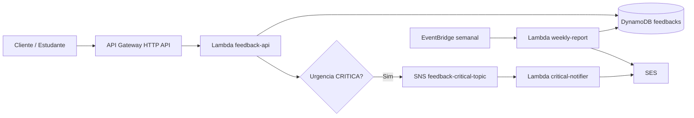

# Arquitetura e Padroes de Software

## Visao Geral Real

O sistema e uma plataforma serverless de feedback educacional em Java/Quarkus. A arquitetura alvo esta expressa no Terraform; a implementacao Java atual cobre a casca dos tres componentes, mas usa adapters em memoria/no-op para as integracoes AWS.

Fluxo arquitetural pretendido e parcialmente implementado:



No codigo atual:

- `feedback-api` atende HTTP, valida payload, classifica urgencia e salva em memoria.
- `feedback-api` chama um publisher critico apenas quando a urgencia e `CRITICA`, mas o adapter atual so registra log.
- `critical-notifier` recebe input Lambda simples e delega para gateway de e-mail no-op.
- `weekly-report` recebe input Lambda simples e delega para gateway de relatorio no-op.
- `shared-kernel` centraliza a classificacao de urgencia usada pela API.

## Estrutura de Pastas e Responsabilidades

```text
apps/feedback-api
+-- core/domain       # Feedback
+-- core/dto          # CriarAvaliacaoCommand
+-- core/gateway      # FeedbackGateway, CriticalFeedbackPublisher
+-- core/usecase      # CriarAvaliacaoUseCase
+-- infra
    +-- config        # ClockProducer
    +-- gateway/db    # InMemoryFeedbackGateway
    +-- gateway/sns   # NoOpCriticalFeedbackPublisher
    +-- http          # AvaliacaoResource, HealthResource

apps/critical-notifier
+-- core/domain       # CriticalFeedbackNotification
+-- core/gateway      # EmailGateway
+-- core/usecase      # NotifyCriticalFeedbackUseCase
+-- infra
    +-- gateway/ses   # NoOpEmailGateway
    +-- lambda        # CriticalNotifierHandler

apps/weekly-report
+-- core/domain       # WeeklyReportRequest
+-- core/gateway      # ReportEmailGateway
+-- core/usecase      # GenerateWeeklyReportUseCase
+-- infra
    +-- gateway/ses   # NoOpReportEmailGateway
    +-- lambda        # WeeklyReportHandler

libs/shared-kernel
+-- shared            # Urgencia, UrgenciaClassifier
```

Infraestrutura:

- `infra/environments/dev`: ambiente local/fakecloud.
- `infra/environments/prod`: ambiente AWS real.
- `infra/modules/api-gateway`: HTTP API com rotas `POST /avaliacao` e `GET /health`.
- `infra/modules/lambda`: funcao Java 21, role IAM, policy e log group.
- `infra/modules/dynamodb`: tabela `feedbacks` e GSI por `periodo`/`dataEnvio`.
- `infra/modules/sns`: topico de feedback critico.
- `infra/modules/ses`: identidades de e-mail.
- `infra/modules/eventbridge`: agendamento semanal para relatorio.
- `infra/modules/cloudwatch`: alarmes e dashboard.

## Fronteiras e Direcao de Acoplamento

Padrao observado: arquitetura hexagonal/clean simples.

- `core` nao deve depender de AWS SDK, API Gateway, Quarkus REST ou detalhes de transporte.
- `core/usecase` depende de ports em `core/gateway`, nao de adapters concretos.
- `infra` implementa os detalhes de entrada/saida: HTTP, Lambda handler, banco, SNS e SES.
- `libs/shared-kernel` deve conter apenas conceitos estaveis e transversais. Hoje contem apenas urgencia e classificador puro.
- Modulos `apps/*` dependem de `shared-kernel`; `shared-kernel` nao depende de nenhum app.

Regra pratica: novas integracoes AWS devem entrar como implementacoes de interfaces em `infra/gateway/*`, mantendo use cases testaveis por doubles simples.

## Fluxo HTTP de Avaliacao

Estado atual implementado:

1. Cliente chama `POST /avaliacao`.
2. `AvaliacaoResource` valida `descricao` e `nota` com Bean Validation.
3. Resource cria `CriarAvaliacaoCommand` e chama `CriarAvaliacaoUseCase`.
4. Use case classifica a nota com `UrgenciaClassifier`.
5. Use case cria `Feedback` com `UUID.randomUUID()` e `Instant.now(clock)`.
6. Use case chama `FeedbackGateway.save`; adapter atual guarda em memoria.
7. Se urgencia for `CRITICA`, use case chama `CriticalFeedbackPublisher.publish`; adapter atual so loga.
8. Resource retorna `201` com `id`, `status=CREATED`, `urgencia` e `dataEnvio`.

Pontos ainda divergentes do contrato completo:

- `periodo` nao e gerado.
- `correlationId` nao e tratado.
- Erros customizados do OpenAPI nao foram implementados.
- Persistencia DynamoDB e publicacao SNS ainda nao substituem os adapters in-memory/no-op.

## Fluxo de Notificacao Critica

Estado de infraestrutura:

1. Terraform cria topico SNS `feedback-critical-topic-<environment>`.
2. Terraform assina a Lambda `critical-notifier-<environment>` no topico.
3. Terraform concede `ses:SendEmail` e `ses:SendRawEmail` ao notifier.

Estado de codigo:

1. `CriticalNotifierHandler` recebe `Input(String feedbackId, String correlationId)`.
2. Handler cria `CriticalFeedbackNotification`.
3. `NotifyCriticalFeedbackUseCase` delega para `EmailGateway`.
4. `NoOpEmailGateway` registra log e nao envia e-mail.

Lacuna arquitetural: o input atual do handler nao corresponde ao envelope real de eventos SNS da AWS. Antes de integrar, e necessario definir se o handler recebera `SNSEvent` ou se havera adaptacao explicita do evento.

## Fluxo de Relatorio Semanal

Estado de infraestrutura:

1. Terraform agenda `weekly-report` por `cron(59 23 ? * SUN *)`.
2. Terraform concede `dynamodb:Query`, `dynamodb:Scan`, `ses:SendEmail` e `ses:SendRawEmail`.
3. DynamoDB tem GSI `dataEnvio-index` para consultar por `periodo` e ordenar por `dataEnvio`.

Estado de codigo:

1. `WeeklyReportHandler` recebe `Input(String periodo)`.
2. Handler cria `WeeklyReportRequest`.
3. `GenerateWeeklyReportUseCase` delega para `ReportEmailGateway`.
4. `NoOpReportEmailGateway` registra log e nao consulta dados nem envia e-mail.

Lacunas arquiteturais:

- Falta gateway de leitura de feedbacks.
- Falta modelo de resumo/metricas do relatorio.
- Falta calculo de periodo quando o input nao vier preenchido.
- Falta idempotencia do envio semanal.

## Padroes Recorrentes Observados

- Records Java para dados imutaveis simples (`Feedback`, comandos, requests, outputs).
- Interfaces `Gateway` como ports de saida.
- Use cases pequenos, sem dependencia direta de frameworks externos.
- Adapters temporarios nomeados como `InMemory...` ou `NoOp...` para deixar lacunas explicitas.
- Recursos HTTP usam records internos para request/response quando ainda nao ha DTO compartilhado.
- Handlers Lambda usam `@Named` com nomes configurados em `application.properties` (`criticalNotifier`, `weeklyReport`).
- Testes de use case injetam doubles por lambda/lista, sem framework de mock.

## Convencoes de Nome

- Endpoint oficial: `POST /avaliacao`, sem acento.
- Health check: `GET /health`.
- Pacotes: `br.com.fiap.feedbackapi`, `br.com.fiap.criticalnotifier`, `br.com.fiap.weeklyreport`, `br.com.fiap.feedbackplatform.shared`.
- Nomes Terraform de recursos: `feedback-api-<environment>`, `critical-notifier-<environment>`, `weekly-report-<environment>`, `feedbacks-<environment>`, `feedback-critical-topic-<environment>`.
- Variaveis de ambiente operacionais: `FEEDBACK_TABLE_NAME`, `CRITICAL_TOPIC_ARN`, `ADMIN_EMAIL_TO`, `EMAIL_FROM`, `AWS_REGION`, `LOG_LEVEL`.

## Como Adicionar Funcionalidades Sem Quebrar o Desenho Atual

- Para DynamoDB, crie um adapter em `apps/feedback-api/infra/gateway/db` que implemente `FeedbackGateway`; nao coloque SDK no use case.
- Para SNS, substitua/adapte `NoOpCriticalFeedbackPublisher` mantendo a interface `CriticalFeedbackPublisher`.
- Para SES no notifier ou relatorio, implemente gateways em `infra/gateway/ses` e preserve os use cases como delegadores/orquestradores.
- Para novos dados compartilhados entre Lambdas, prefira contratos/eventos explicitos; so mova para `shared-kernel` se for conceito estavel de dominio.
- Para erros HTTP, implemente mappers/adapters em `infra/http`, mantendo regras de negocio em `core`.
- Para relatorio, adicione uma porta de leitura de feedbacks no `weekly-report` em vez de reutilizar diretamente classes internas do `feedback-api`.
- Mantenha os caminhos de artefatos `target/function.zip`, pois Terraform depende deles.

## Areas de Atencao Arquitetural

- Os adapters atuais nao cumprem a arquitetura AWS em runtime; eles sao placeholders executaveis.
- `CriticalNotifierHandler` ainda nao processa o formato real de evento SNS.
- `WeeklyReportHandler` ainda nao processa o formato real de evento EventBridge; recebe input proprio simples.
- `shared-kernel` pode virar acoplamento indevido se receber DTOs de API/eventos. Use com parcimonia.
- `weekly-report` tem permissao de `Scan`; isso e aceitavel como fallback inicial, mas o caminho principal deve ser `Query` por `periodo` no GSI.
- Alarmes esperam metricas customizadas que o codigo ainda nao publica.
- Nao ha DLQ configurada para falhas assincronas.
