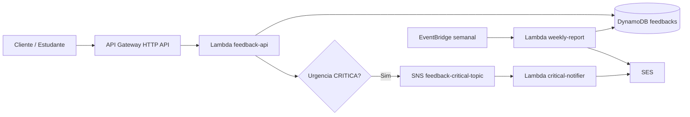

# Arquitetura e Padroes de Software

## Visao Geral Real

O sistema e uma plataforma serverless de feedback educacional em Java/Quarkus. A arquitetura de infraestrutura esta modelada em Terraform. No runtime Java, `feedback-api` e `critical-notifier` ainda usam adapters em memoria/no-op para DynamoDB, SNS e e-mail critico; `weekly-report` ja usa adapters AWS SDK para DynamoDB e SES.

Fluxo alvo modelado:



Estado do codigo atual:

- `feedback-api` atende HTTP, valida payload, gera/reutiliza `X-Correlation-Id`, cria `Feedback`, calcula `periodo`, salva em memoria e chama publisher critico no-op para urgencia `CRITICA`.
- `critical-notifier` recebe input Lambda simples `{feedbackId, correlationId}` e delega para gateway de e-mail no-op.
- `weekly-report` recebe input Lambda simples `{periodo}`, consulta DynamoDB por `periodo`, aplica idempotencia, calcula indicadores e envia e-mail via SES.
- `shared-kernel` centraliza dominio e ports compartilhados usados por mais de um app.

## Estrutura e Responsabilidades

```text
apps/feedback-api
+-- core/dto          # CriarAvaliacaoCommand
+-- core/usecase      # CriarAvaliacaoUseCase
+-- infra/config      # ClockProducer
+-- infra/gateway/db  # InMemoryFeedbackGateway
+-- infra/gateway/sns # NoOpCriticalFeedbackPublisher
+-- infra/http        # AvaliacaoResource, HealthResource

apps/critical-notifier
+-- core/gateway      # EmailGateway
+-- core/usecase      # NotifyCriticalFeedbackUseCase
+-- infra/gateway/ses # NoOpEmailGateway
+-- infra/lambda      # CriticalNotifierHandler

apps/weekly-report
+-- core/domain       # WeeklyFeedback, WeeklyReport, WeeklyReportRequest, WeeklyReportResult
+-- core/gateway      # WeeklyFeedbackReader, WeeklyReportIdempotencyGateway, ReportEmailGateway
+-- core/usecase      # GenerateWeeklyReportUseCase
+-- infra/config      # AwsClientProducer, ClockProducer
+-- infra/gateway/dynamodb # DynamoDbWeeklyFeedbackReader, DynamoDbWeeklyReportIdempotencyGateway
+-- infra/gateway/ses # SesReportEmailGateway
+-- infra/lambda      # WeeklyReportHandler

libs/shared-kernel
+-- domain            # Feedback, CriticalFeedbackEvent, PeriodoIsoWeek, Urgencia*
+-- exception         # DomainValidationException
+-- port              # FeedbackRepository, CriticalFeedbackPublisher
```

Infraestrutura:

- `infra/environments/dev`: ambiente local-only; provider AWS e variaveis fakecloud apontam para `localhost:4566` e nao devem provisionar AWS real.
- `infra/environments/prod`: provider AWS real, sem endpoints locais.
- `infra/modules/api-gateway`: HTTP API, CORS, throttling, rotas `POST /avaliacao` e `GET /health`.
- `infra/modules/lambda`: funcao Java 21, role IAM, policy, variaveis de ambiente e log group.
- `infra/modules/dynamodb`: tabela `feedbacks` e GSI por `periodo`/`dataEnvio`.
- `infra/modules/sns`: topico de feedback critico.
- `infra/modules/ses`: identidades de e-mail.
- `infra/modules/eventbridge`: agendamento semanal.
- `infra/modules/cloudwatch`: alarmes e dashboard.

## Fronteiras e Direcao de Acoplamento

Padrao observado: clean/hexagonal simples.

- `core` nao deve depender de AWS SDK, API Gateway, Quarkus REST, JSON de transporte ou detalhes de Terraform.
- `core/usecase` orquestra regra de aplicacao e depende de ports/interfaces, nao de adapters concretos.
- `infra` contem detalhes de entrada/saida: HTTP, Lambda handlers, banco, SNS, SES e configuracao CDI.
- `shared-kernel` pode ser usado por todos os apps, mas deve ficar restrito a conceitos estaveis de dominio e ports compartilhados.
- `apps/*` podem depender de `shared-kernel`; `shared-kernel` nao depende de nenhum app.
- Contratos de transporte HTTP, SNS e EventBridge nao devem ser misturados com records de dominio sem necessidade clara.

Regra pratica: novas integracoes AWS devem entrar como adapters em `infra/gateway/*` implementando uma porta; use cases devem continuar testaveis com doubles simples.

## Fluxo HTTP de Avaliacao

Implementado hoje:

1. Cliente chama `POST /avaliacao`.
2. `CorrelationIdFilter` gera/reutiliza `X-Correlation-Id`, valida tamanho entre 8 e 100 caracteres e devolve o header na resposta.
3. `AvaliacaoResource` valida `descricao` e `nota` com Bean Validation e le o correlation id do request context.
4. Resource cria `CriarAvaliacaoCommand` e chama `CriarAvaliacaoUseCase`.
5. Use case chama `Feedback.criar` com `UUID.randomUUID()` e `Instant.now(clock)`.
6. `Feedback` normaliza descricao/correlation id, classifica urgencia e calcula `periodo` por semana ISO UTC.
7. Use case chama `FeedbackRepository.save`; adapter atual guarda em memoria.
8. Se urgencia for `CRITICA`, use case publica `CriticalFeedbackEvent.from(feedback)`; adapter atual so loga.
9. Resource retorna `201` com `id`, `status=CREATED`, `urgencia`, `dataEnvio` e header `X-Correlation-Id`.

Divergencias atuais em relacao ao contrato/arquitetura alvo:

- Persistencia DynamoDB e publicacao SNS ainda nao substituem os adapters in-memory/no-op.

## Fluxo de Notificacao Critica

Infraestrutura modelada:

1. Terraform cria SNS `feedback-critical-topic-<environment>`.
2. Terraform assina `critical-notifier-<environment>` no topico.
3. Terraform concede `ses:SendEmail` e `ses:SendRawEmail` ao notifier.

Codigo atual:

1. `CriticalNotifierHandler` recebe `Input(String feedbackId, String correlationId)`.
2. Handler cria `CriticalFeedbackEvent`.
3. `NotifyCriticalFeedbackUseCase` delega para `EmailGateway`.
4. `NoOpEmailGateway` registra log e nao envia e-mail.

Ponto sensivel: o handler ainda nao processa o envelope real de SNS. Antes de integrar, definir se a entrada sera `SNSEvent`, um DTO proprio do envelope, ou uma camada adapter que extraia o payload publicado.

## Fluxo de Relatorio Semanal

Infraestrutura modelada:

1. Terraform agenda `weekly-report` com `cron(59 23 ? * SUN *)`.
2. Terraform concede `dynamodb:Query`, `ses:SendEmail` e `ses:SendRawEmail`.
3. DynamoDB expoe GSI `dataEnvio-index` para consultar por `periodo` e ordenar por `dataEnvio`.

Codigo atual:

1. `WeeklyReportHandler` recebe `Input(String periodo)`.
2. Handler cria `WeeklyReportRequest`.
3. `GenerateWeeklyReportUseCase` resolve o `periodo`, aplica idempotencia, consulta feedbacks, calcula media geral, contagens por dia/urgencia, lista feedbacks criticos e envia o relatorio.
4. `DynamoDbWeeklyFeedbackReader` consulta o GSI `dataEnvio-index` por `periodo`.
5. `DynamoDbWeeklyReportIdempotencyGateway` registra o processamento em `feedback-processing-control-<environment>`, bloqueia periodos `SENT` e permite retry de periodos `FAILED`.
6. `SesReportEmailGateway` envia o relatorio por SES.

Lacunas arquiteturais:

- Falta teste de integracao contra DynamoDB/SES local.
- O `feedback-api` ainda nao grava em DynamoDB; portanto, em execucao integrada local, o `weekly-report` depende de dados semeados por script ou inseridos diretamente na tabela fakecloud.

## Padroes Recorrentes

- Records Java para dados imutaveis simples (`Feedback`, comandos, requests, outputs, eventos).
- Construtores compactos em records de dominio para validar invariantes.
- Interfaces `Gateway`/`Repository`/`Publisher` como ports de saida.
- Use cases pequenos e sem dependencia direta de frameworks externos.
- Adapters temporarios nomeados como `InMemory...` ou `NoOp...` para tornar lacunas explicitas.
- Adapters AWS reais em `weekly-report` mantem SDK e variaveis de ambiente fora do use case.
- Recursos HTTP usam records internos para request/response enquanto nao ha DTO compartilhado estavel.
- Handlers Lambda usam `@Named` e `quarkus.lambda.handler` (`criticalNotifier`, `weeklyReport`).
- `weekly-report` usa MDC para enriquecer logs JSON com contexto operacional.
- Testes de use case usam doubles simples sem framework de mock.

## Convencoes Observadas

- Endpoint oficial: `POST /avaliacao`, sem acento; nao adicionar `/avaliação` sem decisao explicita.
- Health check: `GET /health`.
- Pacotes: `br.com.fiap.feedbackapi`, `br.com.fiap.criticalnotifier`, `br.com.fiap.weeklyreport`, `br.com.fiap.feedbackplatform.shared`.
- Recursos Terraform: `feedback-api-<environment>`, `critical-notifier-<environment>`, `weekly-report-<environment>`, `feedbacks-<environment>`, `feedback-processing-control-<environment>`, `feedback-critical-topic-<environment>`.
- Variaveis de ambiente de runtime: `FEEDBACK_TABLE_NAME`, `PROCESSING_CONTROL_TABLE_NAME`, `CRITICAL_TOPIC_ARN`, `ADMIN_EMAIL_TO`, `EMAIL_FROM`, `AWS_REGION`, `LOG_LEVEL`.
- `periodo` usa formato ISO week UTC `AAAA-Www`, por exemplo `2026-W01`.

## Regras para Evoluir Sem Quebrar o Desenho

- Para DynamoDB, implemente `FeedbackRepository` em `apps/feedback-api/infra/gateway/db`; nao coloque SDK no use case.
- Para SNS, substitua `NoOpCriticalFeedbackPublisher` mantendo `CriticalFeedbackPublisher`.
- Para SES, implemente gateways em `infra/gateway/ses` e preserve use cases como orquestradores.
- Para relatorio, evolua as portas ja existentes em `weekly-report`; nao reutilize classes internas do `feedback-api`.
- Para erros HTTP, implemente mappers/adapters em `infra/http`, mantendo regras de negocio em `shared-kernel`/`core`.
- Para contratos entre Lambdas, versionar payloads explicitamente antes de acoplar handlers a eventos reais.
- Manter artefatos Lambda em `target/function.zip`, pois Terraform depende desses caminhos.

## Areas de Atencao

- `feedback-api` e `critical-notifier` ainda usam adapters placeholder para DynamoDB/SNS/SES.
- `shared-kernel` ja contem dominio e ports compartilhados; evitar transforma-lo em deposito de DTOs de transporte.
- `critical-notifier` e `weekly-report` usam inputs simplificados que nao correspondem aos envelopes reais de SNS/EventBridge.
- `weekly-report` usa `Query` por `periodo` no GSI; a tabela de controle evita envios duplicados por periodo.
- Falhas do relatorio semanal apos iniciar a tentativa de envio sao tratadas como ambiguas e bloqueiam retry automatico; reprocessamento exige reset manual do controle do periodo.
- `infra/environments/dev/` e somente para fakecloud/local. Nao copiar credenciais/endpoints locais para `prod`.
- Alarmes/dashboard esperam metricas customizadas ainda nao publicadas.
- Nao ha DLQ para fluxos assincronos.
