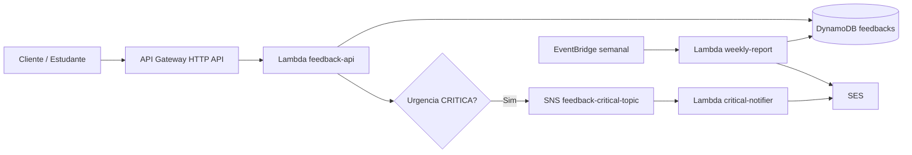

# Arquitetura e Padrões de Software

## Visão Geral

A arquitetura planejada é serverless e orientada a eventos para uma plataforma de feedback educacional. O repositório já possui a infraestrutura Terraform que expressa essa arquitetura, mas a implementação Java/Quarkus ainda não existe.

Fluxos principais:

- estudante envia feedback por `POST /avaliacao`.
- `feedback-api` valida, classifica, persiste e publica evento crítico quando aplicável.
- `critical-notifier` consome o evento SNS e envia e-mail via SES.
- `weekly-report` roda semanalmente, consulta DynamoDB e envia relatório consolidado via SES.



## Estrutura de Pastas Real

Estrutura versionada relevante hoje:

```text
.
├── docs/
│   ├── Especificacao_Tecnica.md
│   └── openapi-feedback-api.yaml
├── infra/
│   ├── environments/
│   │   ├── dev/
│   │   └── prod/
│   └── modules/
│       ├── api-gateway/
│       ├── cloudwatch/
│       ├── dynamodb/
│       ├── eventbridge/
│       ├── lambda/
│       ├── ses/
│       └── sns/
├── tasks/
├── docker-compose.yml
├── mise.toml
└── README.md
```

Estrutura planejada, ainda pendente:

```text
apps/
├── feedback-api/
├── critical-notifier/
└── weekly-report/
libs/
└── shared-kernel/
```

## Fronteiras de Componentes

### `feedback-api`

Responsabilidade esperada:

- atender `POST /avaliacao` e `GET /health`.
- validar payload.
- gerar `id`, `dataEnvio`, `periodo` e `correlationId` quando necessário.
- classificar urgência por nota.
- persistir no DynamoDB.
- publicar evento SNS apenas para `CRITICA`.
- retornar erros no padrão OpenAPI.

Não deve enviar e-mail nem gerar relatório.

### `critical-notifier`

Responsabilidade esperada:

- consumir mensagens do tópico SNS de feedback crítico.
- montar e enviar e-mail administrativo via SES.
- logar sucesso e falhas com `correlationId` e `feedbackId`.

Não deve consultar DynamoDB para montar relatório nem receber HTTP público.

### `weekly-report`

Responsabilidade esperada:

- executar por agendamento semanal.
- consultar feedbacks por `periodo` usando o GSI `dataEnvio-index` quando possível.
- calcular média, contagem por dia e contagem por urgência.
- enviar relatório consolidado por SES.

## Direção de Acoplamento Esperada

A especificação recomenda Clean Architecture para o código Java:

```text
src/main/java/br/com/fiap/{app}/
├── core/
│   ├── domain/
│   ├── dto/
│   ├── exception/
│   ├── gateway/
│   └── usecase/
└── infra/
    ├── config/
    └── gateway/
        ├── db/
        ├── sns/
        └── ses/
```

Regras arquiteturais esperadas:

- domínio não depende de AWS SDK, Quarkus ou detalhes de transporte.
- use cases dependem de interfaces/ports.
- adapters de infraestrutura implementam DynamoDB, SNS e SES.
- DTOs de API/eventos não devem ser usados como entidades de domínio.
- `libs/shared-kernel`, quando criada, deve conter apenas conceitos realmente compartilhados, como `Urgencia`, validações puras ou tipos de erro estáveis.

## Fluxo HTTP de Feedback

1. API Gateway encaminha `POST /avaliacao` para `feedback-api` com payload format version `2.0`.
2. Lambda normaliza ou gera `correlationId`.
3. Payload é validado: `descricao` obrigatória, 10 a 1000 caracteres; `nota` obrigatória, inteira, 0 a 10.
4. Urgência é classificada: 0-3 `CRITICA`, 4-6 `MEDIA`, 7-10 `BAIXA`.
5. Backend gera `id`, `dataEnvio` e `periodo`.
6. Feedback é persistido no DynamoDB.
7. Se `CRITICA`, evento é publicado no SNS.
8. API retorna `201` com `id`, `status`, `urgencia` e `dataEnvio`.

## Fluxo de Notificação Crítica

1. `feedback-api` publica evento no SNS contendo no mínimo `eventType`, `eventVersion`, `feedbackId`, `correlationId`, `dataEnvio`, `periodo`, `descricao`, `nota` e `urgencia`.
2. SNS invoca `critical-notifier`.
3. Lambda deve tratar idempotência por `feedbackId` na tabela auxiliar `feedback-processing-control-<environment>` antes de enviar e-mail, para evitar duplicidade causada por retries.
4. Lambda monta e-mail operacional com `feedbackId`, descrição, nota, urgência, data de envio e `correlationId`.
5. SES envia para `ADMIN_EMAIL_TO` usando `EMAIL_FROM`.

Ponto de atenção: a decisão de idempotência por `feedbackId` está definida, mas a tabela auxiliar e o código ainda não existem.

## Fluxo de Relatório Semanal

1. EventBridge aciona `weekly-report` pelo cron configurado.
2. Lambda determina o `periodo` ISO da semana fechada de referência.
3. Lambda deve tratar idempotência por `periodo` na tabela auxiliar `feedback-processing-control-<environment>`, para evitar envio duplicado em retry ou reprocessamento manual.
4. Consulta DynamoDB via GSI `dataEnvio-index` por `periodo`; `Scan` é permitido pelo IAM como fallback, mas deve ser evitado em volumes maiores.
5. Calcula métricas e separa feedbacks críticos.
6. Envia e-mail consolidado por SES mesmo se não houver feedbacks, com contadores zerados.

Ponto de atenção: o MVP aceita o cron UTC atual `cron(59 23 ? * SUN *)`. Se `America/Sao_Paulo` virar requisito obrigatório, o módulo deve migrar de `aws_cloudwatch_event_rule` para EventBridge Scheduler com timezone.

## Convenções Observadas e Esperadas

- Endpoint público sem acento: `POST /avaliacao`.
- Health check: `GET /health`.
- Nomes de Lambdas: `feedback-api-<environment>`, `critical-notifier-<environment>`, `weekly-report-<environment>`.
- Nome da tabela: `feedbacks-<environment>`.
- Nome da tabela auxiliar de idempotência: `feedback-processing-control-<environment>`.
- Nome do tópico: `feedback-critical-topic-<environment>`.
- Tags Terraform comuns: `Project=feedback-platform`, `Environment=<environment>`, `ManagedBy=terraform`.
- Variáveis de ambiente em caixa alta: `FEEDBACK_TABLE_NAME`, `CRITICAL_TOPIC_ARN`, `ADMIN_EMAIL_TO`, `EMAIL_FROM`, `AWS_REGION`, `LOG_LEVEL`.

## Regras para Adicionar Funcionalidades

- Comece pela fundação Maven/Quarkus e garanta artefatos Lambda nos caminhos esperados pelo Terraform.
- Mantenha o contrato OpenAPI como fonte para request/response HTTP.
- Não misture responsabilidades entre Lambdas; e-mail crítico fica no notifier e relatório fica no job semanal.
- Trate e-mails críticos como operação idempotente por `feedbackId` na tabela auxiliar de controle.
- Trate relatórios semanais como operação idempotente por `periodo` na tabela auxiliar de controle.
- Use `periodo` no modelo de dados para viabilizar relatório por query no GSI.
- Propague `correlationId` entre HTTP, persistência, SNS e logs.
- Mantenha permissões IAM mínimas por função.
- Antes de ampliar infraestrutura, verifique se fakecloud suporta o recurso no fluxo local.
- Não introduza autenticação ou novos ambientes sem decisão explícita; o MVP atual privilegia simplicidade acadêmica.

## Áreas de Atenção Arquitetural

- A aplicação ainda não existe; qualquer padrão de pacote é prescrição da especificação, não padrão observado em código.
- EventBridge atual não configura timezone; UTC é aceito no MVP, mas o módulo precisa evoluir se o horário de São Paulo virar obrigatório.
- Não há DLQ configurada para SNS/Lambdas assíncronas, apesar de a especificação recomendar resiliência.
- O contrato de evento SNS ainda precisa ser implementado em código ou schema, mas o payload mínimo está documentado no fluxo de notificação crítica.
- A tabela auxiliar `feedback-processing-control-<environment>` ainda precisa ser criada no Terraform e usada pela aplicação.
