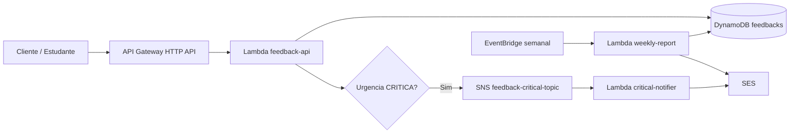

# Arquitetura e Padroes de Software

## Visao Geral Real

O sistema e uma plataforma serverless de feedback educacional em Java/Quarkus. A arquitetura de infraestrutura esta modelada em Terraform. No runtime Java atual, `feedback-api` usa adapters AWS SDK para DynamoDB e SNS; `critical-notifier` processa envelopes SNS, usa DynamoDB para idempotencia e SES para e-mail critico; `weekly-report` usa DynamoDB, idempotencia e SES.

Fluxo alvo modelado:


```mermaid
flowchart LR
    Client[Cliente / Estudante] --> APIGW[API Gateway HTTP API]
    APIGW --> Feedback[Lambda feedback-api]
    Feedback --> DDB[(DynamoDB feedbacks)]
    Feedback --> Critical{Urgencia CRITICA?}
    Critical -- Sim --> SNS[SNS feedback-critical-topic]
    SNS --> Notifier[Lambda critical-notifier]
    Notifier --> SES[SES]
    Scheduler[EventBridge semanal] --> Report[Lambda weekly-report]
    Report --> DDB
    Report --> SES
```

Estado do codigo atual:

- `feedback-api` atende HTTP, valida payload, gera/reutiliza `X-Correlation-Id`, cria `Feedback`, calcula `periodo`, salva no DynamoDB e publica evento SNS para urgencia `CRITICA`.
- `critical-notifier` recebe envelope SNS, extrai `CriticalFeedbackEvent`, aplica controle idempotente em DynamoDB e envia e-mail via SES.
- `weekly-report` recebe input Lambda simples `{periodo}`, consulta DynamoDB por `periodo`, aplica idempotencia, calcula indicadores e envia e-mail via SES.
- `shared-kernel` centraliza dominio e ports compartilhados usados por mais de um app.

## Estrutura e Responsabilidades

```text
apps/feedback-api
+-- core/dto          # CriarAvaliacaoCommand
+-- core/usecase      # CriarAvaliacaoUseCase
+-- infra/config      # AwsClientProducer, ClockProducer, FeedbackConfig
+-- infra/gateway/db  # DynamoDbFeedbackRepository, InMemoryFeedbackGateway sem CDI ativo
+-- infra/gateway/sns # SnsCriticalFeedbackPublisher
+-- infra/http        # AvaliacaoResource, HealthResource

apps/critical-notifier
+-- core/domain       # CriticalNotificationEmail, ProcessingLease
+-- core/gateway      # EmailGateway
+-- core/usecase      # NotifyCriticalFeedbackUseCase
+-- infra/config      # AwsClientProducer, ClockProducer
+-- infra/gateway/dynamodb # DynamoDbCriticalNotificationIdempotencyGateway
+-- infra/gateway/ses # SesCriticalEmailGateway
+-- infra/lambda      # CriticalNotifierHandler, SnsCriticalFeedbackEventParser

apps/weekly-report
+-- core/domain       # WeeklyFeedback, WeeklyReport, WeeklyReportRequest, WeeklyReportResult
+-- core/gateway      # WeeklyFeedbackReader, WeeklyReportIdempotencyGateway, ReportEmailGateway
+-- core/usecase      # GenerateWeeklyReportUseCase
+-- infra/config      # AwsClientProducer, ClockProducer
+-- infra/gateway/dynamodb # DynamoDbWeeklyFeedbackReader, DynamoDbWeeklyReportIdempotencyGateway
+-- infra/gateway/ses # SesReportEmailGateway
+-- infra/lambda      # WeeklyReportHandler

libs/shared-kernel
+-- domain            # Feedback, CriticalFeedbackEvent, PeriodoIsoWeek, Urgencia*
+-- exception         # DomainValidationException
+-- port              # FeedbackRepository, CriticalFeedbackPublisher
```

Infraestrutura:

- `infra/environments/dev`: ambiente local-only; provider AWS e variaveis fakecloud apontam para `localhost:4566` e nao devem provisionar AWS real.
- `infra/environments/prod`: provider AWS real, sem endpoints locais.
- `infra/modules/api-gateway`: HTTP API, CORS, throttling, rotas `POST /avaliacao` e `GET /health`.
- `infra/modules/lambda`: funcao Java 21, role IAM, policy, variaveis de ambiente e log group.
- `infra/modules/dynamodb`: tabela `feedbacks` e GSI por `periodo`/`dataEnvio`.
- `infra/modules/sns`: topico de feedback critico.
- `infra/modules/ses`: identidades de e-mail.
- `infra/modules/eventbridge`: agendamento semanal.
- `infra/modules/cloudwatch`: alarmes e dashboard.

## Fronteiras e Direcao de Acoplamento

Padrao observado: clean/hexagonal simples.

- `core` nao depende de AWS SDK, API Gateway, Quarkus REST, JSON de transporte ou Terraform. Ele usa CDI nos casos de uso e JBoss Logging/MDC no relatorio, portanto a separacao observada e de adapters, nao neutralidade total a frameworks.
- `core/usecase` orquestra regra de aplicacao e depende de ports/interfaces, nao de adapters concretos.
- `infra` contem detalhes de entrada/saida: HTTP, Lambda handlers, banco, SNS, SES e configuracao CDI.
- `shared-kernel` pode ser usado por todos os apps, mas deve ficar restrito a conceitos estaveis de dominio e ports compartilhados.
- `apps/*` podem depender de `shared-kernel`; `shared-kernel` nao depende de nenhum app.
- Contratos de transporte HTTP, SNS e EventBridge nao devem ser misturados com records de dominio sem necessidade clara.

Regra pratica: novas integracoes AWS devem entrar como adapters em `infra/gateway/*` implementando uma porta; use cases devem continuar testaveis com doubles simples.

## Fluxo HTTP de Avaliacao

Implementado hoje:

1. Cliente chama `POST /avaliacao`.
2. `CorrelationIdFilter` gera/reutiliza `X-Correlation-Id`, valida tamanho entre 8 e 100 caracteres e devolve o header na resposta.
3. `AvaliacaoResource` valida `descricao` e `nota` com Bean Validation e le o correlation id do request context.
4. Resource cria `CriarAvaliacaoCommand` e chama `CriarAvaliacaoUseCase`.
5. Use case chama `Feedback.criar` com `UUID.randomUUID()` e `Instant.now(clock)`.
6. `Feedback` normaliza descricao/correlation id, classifica urgencia e calcula `periodo` por semana ISO UTC.
7. Use case chama `FeedbackRepository.save`; adapter CDI ativo grava item na tabela DynamoDB configurada por `FEEDBACK_TABLE_NAME`.
8. Se urgencia for `CRITICA`, use case publica `CriticalFeedbackEvent.from(feedback)` no topico SNS configurado por `CRITICAL_TOPIC_ARN`.
9. Resource retorna `201` com `id`, `status=CREATED`, `urgencia`, `dataEnvio` e header `X-Correlation-Id`.

## Fluxo de Notificacao Critica

Infraestrutura modelada:

1. Terraform cria SNS `feedback-critical-topic-<environment>`.
2. Terraform assina `critical-notifier-<environment>` no topico.
3. Terraform concede `ses:SendEmail` e `ses:SendRawEmail` ao notifier.

Codigo atual:

1. `CriticalNotifierHandler`, exposto como `criticalNotifier`, recebe o payload Lambda e delega a leitura do envelope ao `SnsCriticalFeedbackEventParser`.
2. O parser extrai mensagens SNS e cria `CriticalFeedbackEvent` com os campos do dominio compartilhado.
3. `NotifyCriticalFeedbackUseCase` tenta adquirir controle idempotente em `feedback-processing-control-<environment>` antes de enviar.
4. `SesCriticalEmailGateway` envia o e-mail administrativo via SES.
5. O caso de uso marca sucesso quando o envio conclui; estados ambiguos ou em progresso bloqueiam retry automatico para evitar duplicidade.

Ponto sensivel: alarmes CloudWatch ainda usam o mesmo topico SNS dos feedbacks criticos. Manter mensagens operacionais separadas ou filtradas evita que o notifier tente interpretar alertas como feedback critico.

## Fluxo de Relatorio Semanal

Infraestrutura modelada:

1. Terraform agenda `weekly-report` com `cron(59 23 ? * SUN *)` em UTC, sem configurar `target.input`.
2. Terraform concede `dynamodb:Query`, `ses:SendEmail` e `ses:SendRawEmail`.
3. DynamoDB expoe GSI `dataEnvio-index` para consultar por `periodo` e ordenar por `dataEnvio`.

Codigo atual:

1. `WeeklyReportHandler` recebe `Input(String periodo)`.
2. Handler cria `WeeklyReportRequest`.
3. `GenerateWeeklyReportUseCase` resolve o `periodo`, aplica idempotencia, consulta feedbacks, calcula media geral, contagens por dia/urgencia, lista feedbacks criticos e envia o relatorio.
4. `DynamoDbWeeklyFeedbackReader` consulta o GSI `dataEnvio-index` por `periodo`.
5. `DynamoDbWeeklyReportIdempotencyGateway` registra o processamento em `feedback-processing-control-<environment>`; apenas `FAILED_BEFORE_SEND` permite retry. `PROCESSING`, `SENT` e `FAILED_AFTER_SEND_ATTEMPT` bloqueiam nova execucao.
6. `SesReportEmailGateway` envia o relatorio por SES.

Lacunas arquiteturais e de validacao:

- O `make smoke` cobre apenas `POST /avaliacao` retornando `201`; nao comprova persistencia, SNS, notificacao nem relatorio.
- O script E2E local ainda precisa de revisao porque suas mensagens finais dizem que o pipeline unificado esta adiado, apesar dos adapters existirem no runtime.
- O contrato Scheduler -> handler nao esta validado: o Scheduler nao envia payload explicito, enquanto o handler aceita um record proprio opcional. Com entrada nula/vazia, o use case calcula a semana atual em UTC.

## Padroes Recorrentes

- Records Java para dados imutaveis simples (`Feedback`, comandos, requests, outputs, eventos).
- Construtores compactos em records de dominio para validar invariantes.
- Interfaces `Gateway`/`Repository`/`Publisher` como ports de saida.
- Use cases pequenos, dependentes de ports; CDI e logging ainda aparecem no `core`.
- Adapters AWS reais em `infra/gateway/*` mantem SDK e variaveis de ambiente fora dos use cases.
- Doubles em memoria aparecem em testes e o `InMemoryFeedbackGateway` permanece no codigo sem CDI ativo, mas nao representa o adapter runtime principal.
- Recursos HTTP usam records internos para request/response enquanto nao ha DTO compartilhado estavel.
- Handlers Lambda usam `@Named` e `quarkus.lambda.handler` (`criticalNotifier`, `weeklyReport`).
- `weekly-report` usa MDC para enriquecer logs JSON com contexto operacional.
- Testes de use case usam doubles simples sem framework de mock.

## Convencoes Observadas

- Endpoint oficial: `POST /avaliacao`, sem acento; nao adicionar `/avaliação` sem decisao explicita.
- Health check: `GET /health`.
- Pacotes: `br.com.fiap.feedbackapi`, `br.com.fiap.criticalnotifier`, `br.com.fiap.weeklyreport`, `br.com.fiap.feedbackplatform.shared`.
- Recursos Terraform: `feedback-api-<environment>`, `critical-notifier-<environment>`, `weekly-report-<environment>`, `feedbacks-<environment>`, `feedback-processing-control-<environment>`, `feedback-critical-topic-<environment>`.
- Variaveis consumidas pelo runtime: `feedback-api` usa `FEEDBACK_TABLE_NAME`, `CRITICAL_TOPIC_ARN`, `AWS_REGION`, `AWS_ENDPOINT_URL` e `LOG_LEVEL`; `critical-notifier` usa `PROCESSING_CONTROL_TABLE_NAME`, `ADMIN_EMAIL_TO`, `EMAIL_FROM`, `AWS_REGION`, `AWS_ENDPOINT_URL` e `LOG_LEVEL`; `weekly-report` usa `FEEDBACK_TABLE_NAME`, `PROCESSING_CONTROL_TABLE_NAME`, `ADMIN_EMAIL_TO`, `EMAIL_FROM`, `AWS_REGION`, `AWS_ENDPOINT_URL` e `LOG_LEVEL`.
- `periodo` usa formato ISO week UTC `AAAA-Www`, por exemplo `2026-W01`; o cadastro de feedback e o relatorio semanal seguem a mesma convencao.

## Regras para Evoluir Sem Quebrar o Desenho

- Para novos acessos DynamoDB, mantenha SDK em `infra/gateway/*`; nao coloque SDK no use case.
- Para SNS, preserve `CriticalFeedbackPublisher` e versionamento claro do payload.
- Para SES, preserve gateways em `infra/gateway/ses` e use cases como orquestradores.
- Para relatorio, evolua as portas ja existentes em `weekly-report`; nao reutilize classes internas do `feedback-api`.
- Para erros HTTP, implemente mappers/adapters em `infra/http`, mantendo regras de negocio em `shared-kernel`/`core`.
- Para contratos entre Lambdas, versionar payloads explicitamente antes de acoplar handlers a eventos reais.
- Manter artefatos Lambda em `target/function.zip`, pois Terraform depende desses caminhos.

## Areas de Atencao

- `shared-kernel` ja contem dominio e ports compartilhados; evitar transforma-lo em deposito de DTOs de transporte.
- No relatorio, falta validar o contrato entre o payload efetivo do EventBridge Scheduler e o input proprio do handler.
- `weekly-report` usa `Query` por `periodo` no GSI; a tabela de controle evita envios duplicados por periodo.
- Falhas do relatorio semanal apos iniciar a tentativa de envio sao tratadas como ambiguas e bloqueiam retry automatico; reprocessamento exige reset manual do controle do periodo.
- Um estado `PROCESSING` nao possui lease/TTL ou recuperacao automatica e pode bloquear um periodo indefinidamente apos crash.
- A notificacao critica tambem privilegia prevencao de duplicidade: estados ambiguos, envio em progresso e falhas permanentes exigem reconciliacao manual.
- `infra/environments/dev/` e somente para fakecloud/local. Nao copiar credenciais/endpoints locais para `prod`.
- Alarmes/dashboard esperam metricas customizadas ainda nao publicadas.
- Nao ha DLQ para fluxos assincronos.
